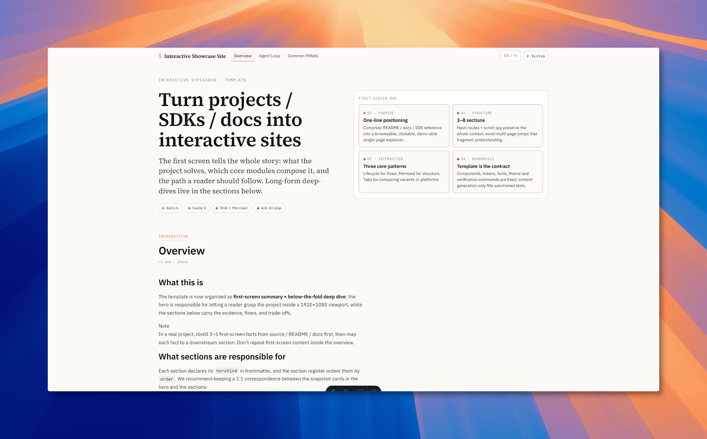

# Interactive Showcase Site

> Turn a README, SDK, or docs folder into a bilingual interactive single-page explainer site.

[简体中文](README.zh.md)



## Intent

`interactive-showcase-site` is an Agent Skill for turning a project, SDK, README, or docs folder into a buildable interactive explainer site.

The design goal is not a generic documentation portal. It is a focused, editorial single-page artifact that helps a reader understand a technical system quickly: what it is, how it works, where the main risks are, and which details are worth exploring.

Its visual language follows the Claude design direction embedded in Anthropic system prompts: warm paper-like neutrals, clay/coral accents, serif editorial hierarchy, restrained motion, no generic AI gradients, no emoji decoration, and no noisy “AI slop” tropes. The template uses Source Serif 4, IBM Plex Sans, and JetBrains Mono with a tokenized light/dark theme.

The interaction model is inspired by technical explainers such as `ccunpacked.dev` and `deep-dive-claude-code.vercel.app`: scroll-spy navigation for orientation, click-to-detail Mermaid diagrams for structure, autoplaying lifecycle panels for workflows, tabs for implementation tradeoffs, callouts for TL;DR moments, and copy-aware code blocks. The first screen is designed as an executive project summary; the rest of the page becomes the deep dive.

## Installation

Install through a Claude Code plugin marketplace:

```shell
/plugin marketplace add <owner>/<repo>
/plugin install interactive-showcase-site@interactive-showcase-site-skills
```

Invoke it in Claude Code:

```shell
/interactive-showcase-site:interactive-showcase-site
```

Install through the Agent Skills CLI:

```shell
npx skills add <owner>/<repo> --skill interactive-showcase-site
```

For a global skills install:

```shell
npx skills add <owner>/<repo> --skill interactive-showcase-site -g
```
